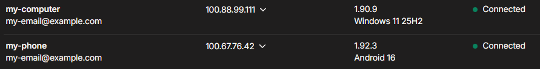

# Access methods

How to make your Hydrus Client API accessible to hyAway.

---

## TL;DR

- Same machine: simplest (no extra networking setup)
- Remote: use Tailscale Serve (recommended) to get a private HTTPS URL (works at home on the same Wi-Fi too)
- Advanced: Local network (Wi-Fi/LAN) works, but requires enabling non-local connections + firewall changes
- Next: open [hyaway.com/settings/connection](https://hyaway.com/settings/connection) (**Settings → Connection**) and paste the URL for your chosen method

## Choose your access method

| Setup                                                    | Best For                                                    | Difficulty       |
| -------------------------------------------------------- | ----------------------------------------------------------- | ---------------- |
| [**Same Machine**](#same-machine)                        | Using hyAway on the same computer as Hydrus                 | Easy (~2 min)    |
| [**Remote Access**](#remote-access-with-tailscale)       | Accessing Hydrus from your phone, laptop, or another device | Medium (~10 min) |
| [**Local Network (advanced)**](#local-network-wi-fi-lan) | Using hyAway on your phone/tablet on the same Wi-Fi / LAN   | Medium (~10 min) |

> **Already have remote access configured?** If you're using a reverse proxy, VPN, or another method to expose Hydrus remotely, that will work as well. Just use your existing URL when [connecting](./connect).

---

## Same machine

Use this setup if you're using hyAway on the **same computer** where Hydrus is running.

**Your endpoint URL is:** `http://127.0.0.1:45869`

Next: open **Settings → Connection** (or [hyaway.com/settings/connection](https://hyaway.com/settings/connection)) and enter your endpoint + access key.

---

## Remote access with Tailscale

Use this setup to access Hydrus from your phone, laptop, or any other device.

This also works great when you're on the same Wi-Fi/LAN — many people prefer using Tailscale everywhere so they don't have to switch setups between "at home" and "away".

```
┌─────────────────┐     Tailscale      ┌──────────────────────┐
│  Your Phone/    │◄──── secure ──────►│  Home Computer       │
│  Laptop         │      tunnel        │                      │
│                 │                    │  ┌────────────────┐  │
│  hyaway.com ────┼────────────────────┼─►│ Hydrus :45869  │  │
│                 │                    │  └────────────────┘  │
└─────────────────┘                    └──────────────────────┘
```

[Tailscale](https://tailscale.com) creates an encrypted, private network between your devices — no port forwarding or firewall configuration needed.

### Install Tailscale

1. [Download and install Tailscale](https://tailscale.com/download) on your home computer (where Hydrus runs)
2. Install Tailscale on any devices you want to access Hydrus from (phone, laptop, etc.)
3. Sign in with the same account on all devices — this creates your **tailnet** (your private Tailscale network)



### Expose Hydrus via Tailscale Serve

On your home computer, open a terminal:

- **Windows:** Press `Win + X` and select **Terminal** or **PowerShell**
- **Mac:** Open **Terminal** from Applications → Utilities
- **Linux:** Open your terminal app

Recommended (URL without a port):

```bash
tailscale serve --bg 45869
```

> This command means: "Expose my local Hydrus port 45869 over HTTPS on my tailnet." The `--bg` flag runs it in the background so you can close the terminal.
>
> With this variant, your Tailscale URL usually looks like `https://my-computer.tail1234.ts.net` (no `:45869`).
>
> **Want to try it temporarily first?** Run without `--bg` to test. Press `Ctrl+C` to stop when done.
>
> **To disable later:** Run `tailscale serve 45869 off` to stop exposing Hydrus.

If you prefer keeping the port number in the URL:

```bash
tailscale serve --bg --https 45869 http://127.0.0.1:45869
```

If this is your first time using Tailscale Serve, it will prompt you to enable HTTPS for your tailnet.

You'll see output like:

```
Available within your tailnet:

https://my-computer.tail1234.ts.net/
|-- proxy http://127.0.0.1:45869

Serve started and running in the background.
To disable the proxy, run: tailscale serve 45869 off
```

**Take note of your Tailscale URL** (e.g., `https://my-computer.tail1234.ts.net:45869`) — you'll need it when connecting. You can also find this in the Tailscale app by clicking on your machine name to copy it.

### Finding your Tailscale URL later

Run this command on your home computer:

```bash
tailscale status
```

Look for your machine name and domain, e.g., `my-computer.tail1234.ts.net`

---

## Local network (Wi-Fi / LAN)

Use this setup if you want to use hyAway from another device on your home network (e.g. phone/tablet on the same Wi-Fi).

::: warning Security warning
Hydrus Client API has no built-in login screen. If you allow non-local connections, anyone on your network who can reach the port can try to connect.

If you want the safer default for phones/tablets, use [Remote access with Tailscale](#remote-access-with-tailscale) instead.
:::

### Enable non-local connections

In Hydrus: **services → manage services → client api**

- Check **allow non-local connections**
- Keep **support CORS headers** enabled

### Find your endpoint URL

Your endpoint will be:

`http://<YOUR-HOME-COMPUTER-IP>:45869`

Examples: `http://192.168.1.50:45869` or `http://10.0.0.12:45869`

To find your IP:

- Windows: run `ipconfig` and look for **IPv4 Address**
- macOS: run `ifconfig` and look for `inet`
- Linux: run `ip a` and look for `inet`

### Firewall check

Make sure your OS firewall allows inbound TCP to port `45869` from your local network.

---

## Next step

Once you have your endpoint URL, continue to [Connect to Hydrus](./connect).

---

## Security notes

### Why Tailscale?

Tailscale creates an encrypted, private network between your devices. When you use Tailscale Serve:

- Hydrus is **only accessible to devices on your tailnet** — not the public internet
- All traffic is **encrypted end-to-end**
- You don't need to open ports on your router or configure firewalls
- Your Hydrus instance remains "local only" — Tailscale handles the secure tunneling

### Tailscale Serve vs Funnel

- **Tailscale Serve**: Private, only accessible to your tailnet
- **Tailscale Funnel**: Public access — anyone on the internet can try to connect. Only use if you explicitly want this.

---

## Stopping Tailscale Serve

If you want to stop exposing Hydrus:

```bash
# If running in foreground: press Ctrl+C

# If running in background:
tailscale serve --https=45869 off
```

---

## Other access methods

Tailscale isn't the only option. You can also use:

- **Reverse proxy** (nginx, Caddy, Traefik) — If you already have one set up
- **VPN** (WireGuard, OpenVPN) — If you have an existing VPN to your home network
- **Port forwarding** — Not recommended due to security concerns, but works if you know what you're doing

With any of these, just use your custom URL when [connecting](./connect).

---

## Getting help

- [Tailscale Serve documentation](https://tailscale.com/kb/1312/serve)
- [hydrus network documentation](https://hydrusnetwork.github.io/hydrus/)
