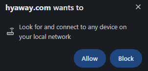
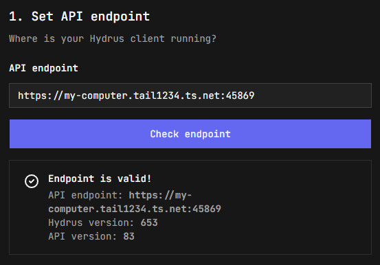
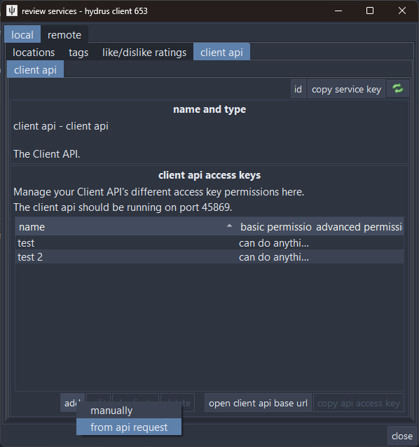
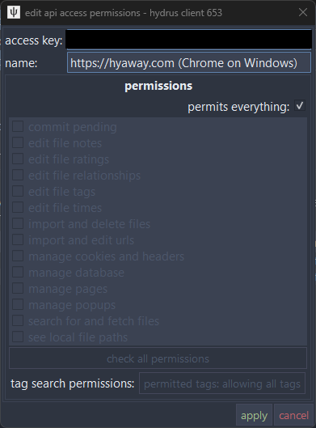
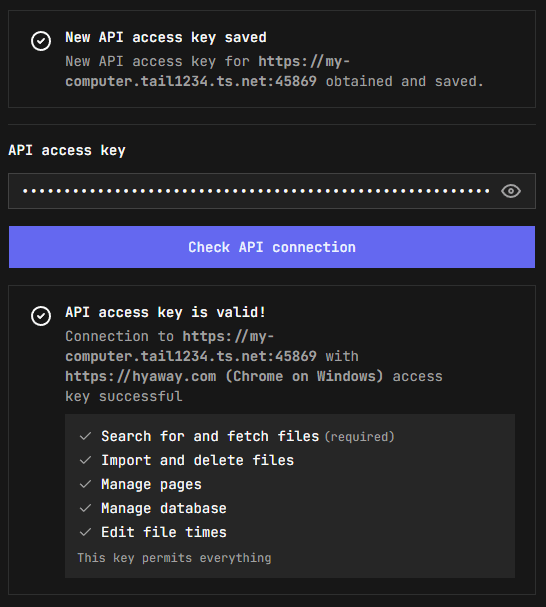

# Connect to Hydrus

Connect hyAway to your Hydrus client by setting the API endpoint and access key.

::: tip Prerequisites

1. [Enable the Hydrus Client API](./getting-started#enable-the-hydrus-client-api)
2. Know your endpoint URL — see [Access methods](./access-methods) if you need remote access
   :::

## TL;DR

1. Set endpoint (same machine: `http://127.0.0.1:45869`; Tailscale: `https://my-computer.tail1234.ts.net`)
2. Request/enter access key
3. Press **Check endpoint** / **Check API connection** until both are green

---

## Open connection settings

1. Go to [hyaway.com/settings/connection](https://hyaway.com/settings/connection) (or **Settings → Connection**)
2. If using Tailscale, make sure it's **connected** on your device

---

## Step 1: Set the API endpoint

Enter your endpoint URL:

- **Same machine:** `http://127.0.0.1:45869`
- **Tailscale:** `https://my-computer.tail1234.ts.net` (or `https://my-computer.tail1234.ts.net:45869` if you configured Serve to keep the port) — see [Remote access with Tailscale](./access-methods#remote-access-with-tailscale)
- **Local network (Wi‑Fi/LAN, advanced):** `http://192.168.1.50:45869` (see [Local network access](./access-methods#local-network-wi-fi-lan))
- **Custom setup (advanced):** Your reverse proxy or VPN URL

Click **Check endpoint** to verify the connection. You should see the Hydrus and API version numbers.

> **Note:** Your browser may ask for permission to access your local network. This is expected — Tailscale addresses are treated as private network addresses. Click **Allow** to continue.
>
> 

---

## Step 2: Get an access key

Choose one of these options:

### Option A: Request a new key (recommended)

**In Hydrus:**

1. Go to **services → review services**
2. In the left panel, expand **local** and select **client api**
3. Click **add → from api request** — a dialog will appear waiting for the request

   

**In hyaway.com:**

4. Click **Request new API access key**

**Back in Hydrus:**

5. A permission approval dialog will appear — review the permissions and click **Apply**

   

**In hyaway.com:**

6. You'll see **New API access key saved** — the key is stored automatically
7. Click **Check API connection** to verify everything works

> **Note:** If you see a "Complete the Hydrus permissions flow" message after checking, make sure you clicked **Apply** in the Hydrus dialog, then click **Check API connection** again.

### Option B: Use an existing key

1. In Hydrus, go to **services → review services**, then select **local → client api** in the left panel
2. Click **add → manually**
3. Give the key a name (e.g., "hyAway")
4. Select the permissions you want to grant
5. Copy the 64-character access key
6. In hyaway.com, paste the key and click **Check API connection**

---

## Step 3: Verify connection

Once configured, you'll see these success messages in each card:

- **Endpoint is valid!**
- **API access key is valid!**
- **Session key is valid!**

## Step 4: Start browsing

At this point, hyAway should be connected to your Hydrus client and you can start browsing.

Try visiting [Pages](https://hyaway.com/pages) to see your Hydrus pages.

---

## Permissions reference

hyAway requests these permissions from the [Hydrus Client API](https://hydrusnetwork.github.io/hydrus/client_api.html):

| Permission                 | Required | Purpose                                          |
| -------------------------- | -------- | ------------------------------------------------ |
| Search for and fetch files | ✓ Yes    | Core functionality — browsing and viewing files  |
| Import and delete files    | Optional | Archive/trash file management                    |
| Manage pages               | Optional | View and interact with Hydrus pages              |
| Manage database            | Optional | Access thumbnail dimensions and namespace colors |
| Edit file times            | Optional | Sync view statistics to Hydrus                   |

You can grant all permissions or only the ones you need.

---

## Troubleshooting

### "Connection refused" or "Network error"

- **Check Hydrus is running** and the Client API is enabled
- **Verify the port** is `45869` (or matches your configuration)
- **Check the URL** — use `https://` for Tailscale URLs
- **Confirm Tailscale is connected** on both your device and home computer

### "403 Forbidden" when requesting access key

- Make sure you have the **"add → from api request"** dialog open in Hydrus
- The dialog must be open _before_ you click the request button in hyaway.com

### "419 Session Expired"

hyAway automatically refreshes expired sessions. If it persists:

- Check that your access key is still valid in Hydrus
- Try **Settings → Connection → Reset** and reconfigure

### Can't reach Hydrus

**Same machine setup:**

- Confirm Hydrus is running and `http://127.0.0.1:45869` loads in your browser

**Tailscale setup:**

- Confirm `tailscale serve` is running on your home computer
- Verify you're using the correct Tailscale URL (run `tailscale status` to check)
- On the home computer, confirm `http://127.0.0.1:45869` loads in a browser
- Ensure Tailscale is connected on your current device

---

## Security notes

### Access keys vs session keys

- **Access key**: long-lived secret (treat it like a password). In Hydrus terms, the access key _is the account_.
- **Session key**: short-lived key derived from the access key. Session keys expire, and they also reset when the Hydrus client restarts.

hyAway uses **session keys by default**, which means:

- Your access key is only used to obtain a session key when needed, rather than being sent with every API request.
- If the Hydrus client restarts (or the session expires), hyAway will request a fresh session key automatically.

hyAway stores your endpoint + keys in your browser's local storage.

---

## Getting help

- [hyAway GitHub Issues](https://github.com/hyaway/hyaway/issues)
- [hydrus network documentation](https://hydrusnetwork.github.io/hydrus/)
- [Hydrus Client API docs](https://hydrusnetwork.github.io/hydrus/client_api.html)
