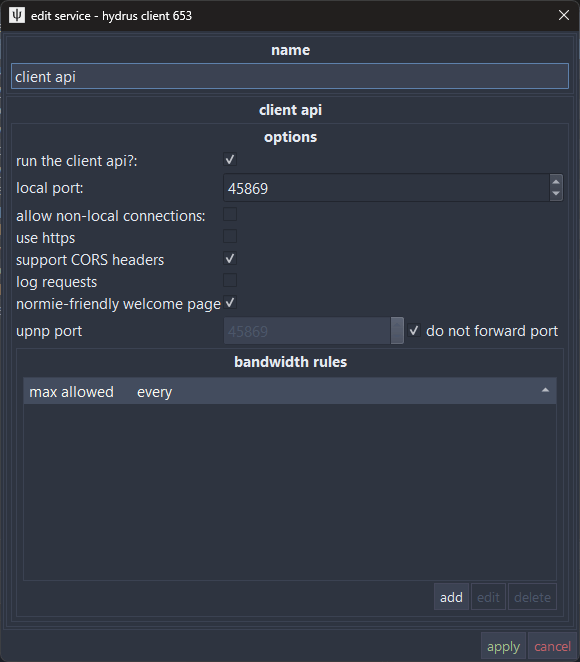
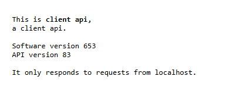

# Getting started

This guide walks you through enabling the Hydrus Client API so hyAway can communicate with your Hydrus client.

---

## Enable the Hydrus client API

The [Client API](https://hydrusnetwork.github.io/hydrus/client_api.html) lets external apps like hyAway communicate with Hydrus.

1. In Hydrus, go to **services → manage services**
2. Look for an existing **client api** service, or click **add → client api** to create one
3. Set the port to `45869` (Hydrus default)
4. Leave **allow non-local connections** unchecked (both same-machine and Tailscale setups use local connections)
5. Check **support CORS headers** (required for connecting between hyaway.com and your own domain)
6. Click **Apply**

> **Why CORS?** When you visit hyaway.com, your browser runs code from that website. By default, browsers don't let websites talk to other servers (like your local Hydrus) — this is a security feature. Enabling CORS tells Hydrus "it's okay for hyaway.com to connect to me."



### Verify the API is running

Open your browser and navigate to:

```
http://127.0.0.1:45869
```

You should see a welcome page.



---

## Choose your setup

| Setup           | Best For                                    | Link                                      |
| --------------- | ------------------------------------------- | ----------------------------------------- |
| **hyaway.com**  | No installation needed — use the hosted app | [Connect to hyaway.com →](./connect)      |
| **Self-hosted** | Run your own hyAway instance                | [Self-hosting options →](./self-hosting/) |

---

## Next steps

- [Access methods](./access-methods) — Same machine vs remote access
- [Connect to Hydrus](./connect) — Set up your API connection
- [Self-host with Docker](./self-hosting/docker) — Run your own instance
- [Local development](./self-hosting/local-dev) — Contribute or customize

---

## Learn more about Hydrus

- [Hydrus Network Documentation](https://hydrusnetwork.github.io/hydrus/) — Official docs
- [Client API reference](https://hydrusnetwork.github.io/hydrus/client_api.html) — API endpoints and parameters
- [Getting started with Hydrus](https://hydrusnetwork.github.io/hydrus/getting_started_installing.html) — New to Hydrus?
