# Screenshots

A visual tour of hyAway's main features.

## Review queue

### Archive (swipe right)

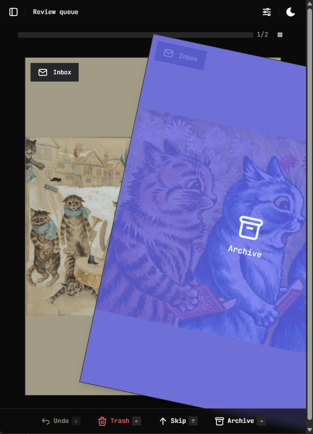

### Trash (swipe left)

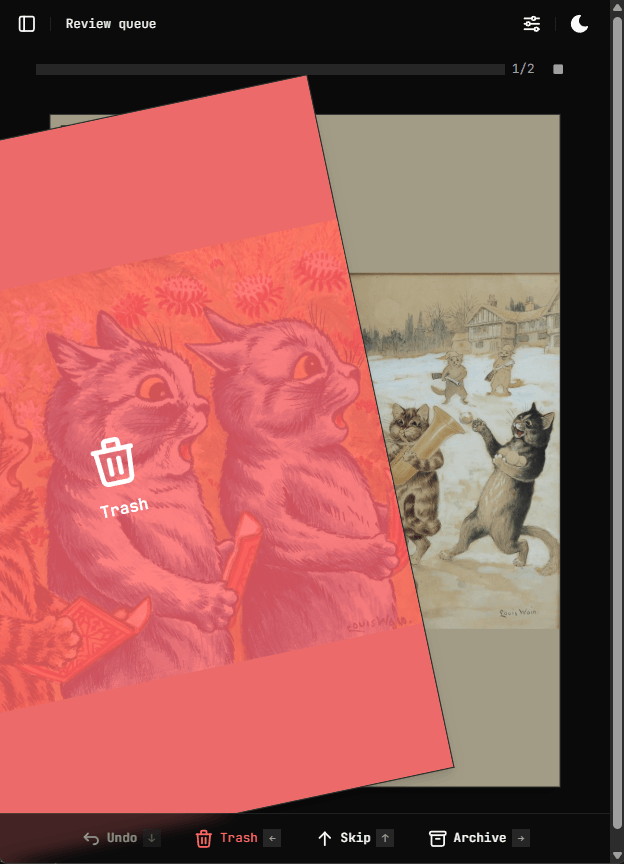

### Skip (swipe up)

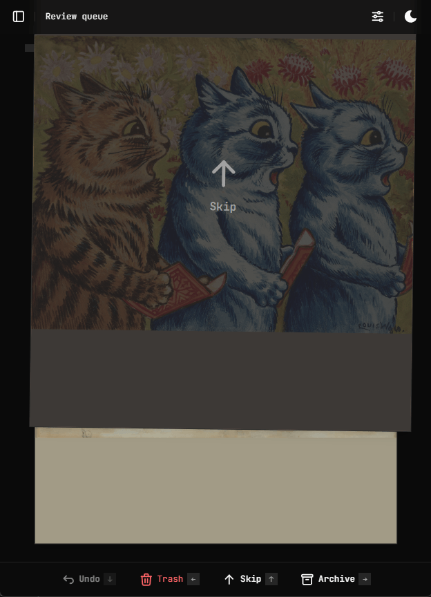

---

## Gallery

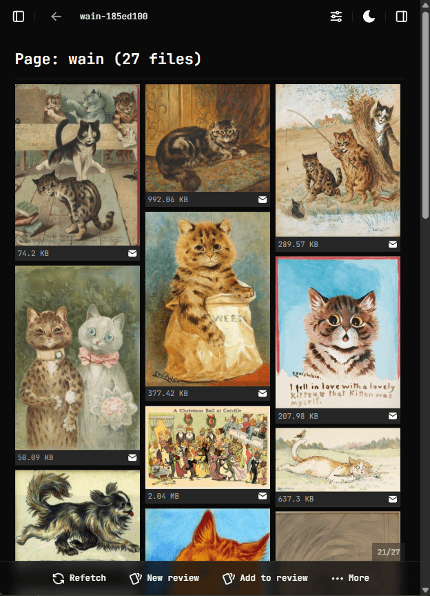

### Tags sidebar

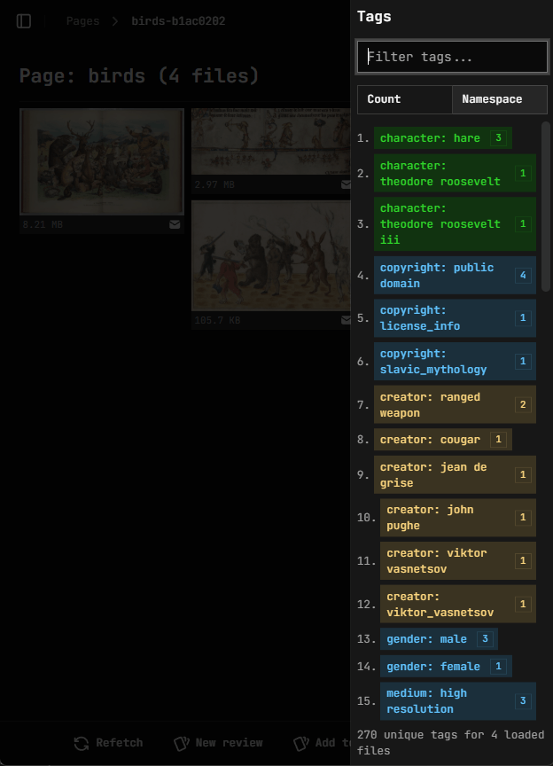

---

## File viewer

### Inline view

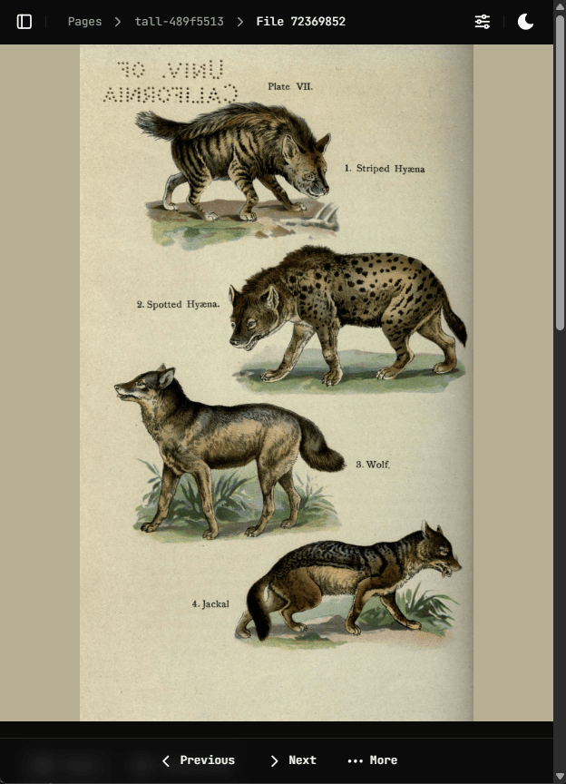

### Expanded view

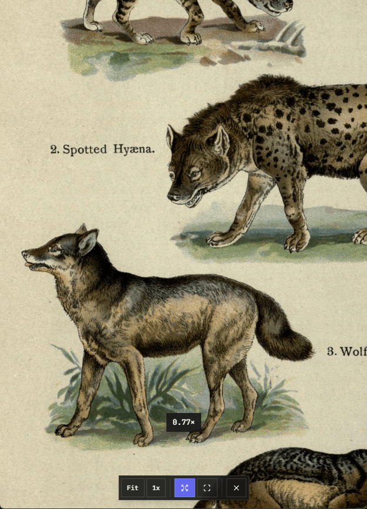

### Metadata and tags

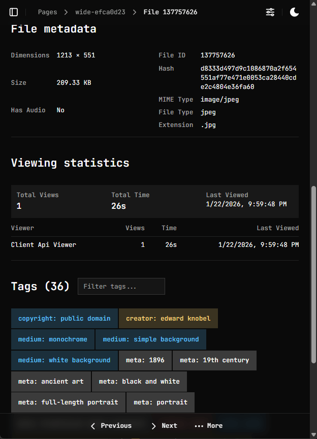

### Video player

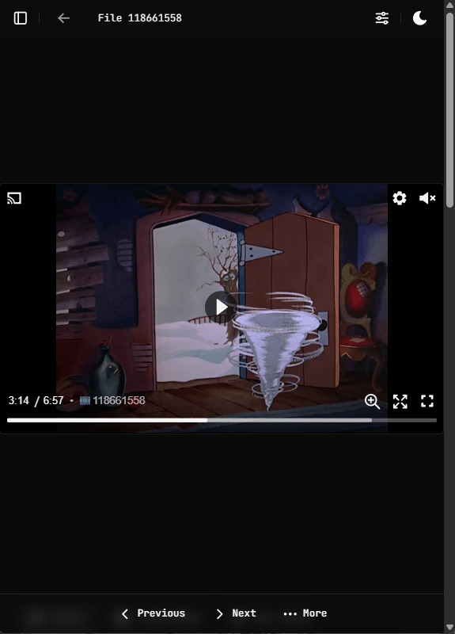

---

## Hydrus pages

### Pages index

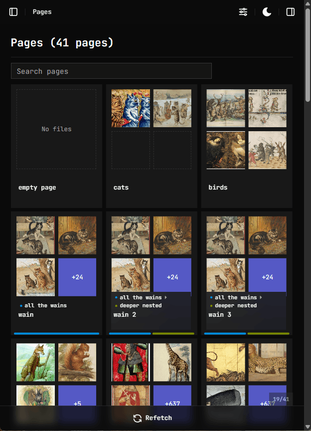

### Pages sidebar

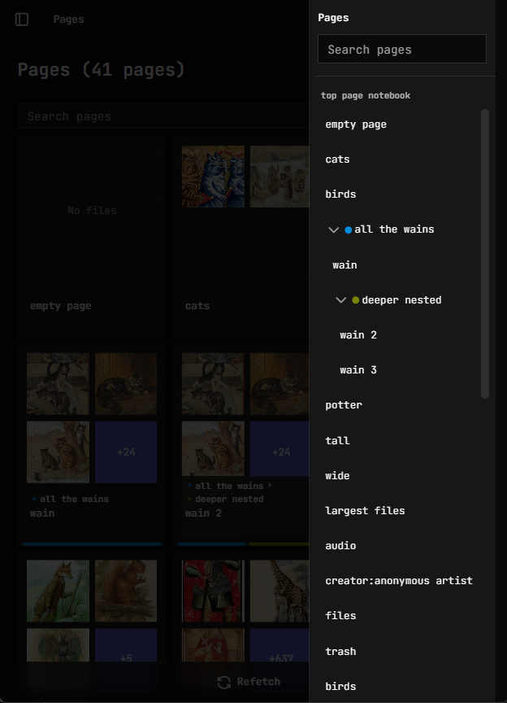

### Pages search

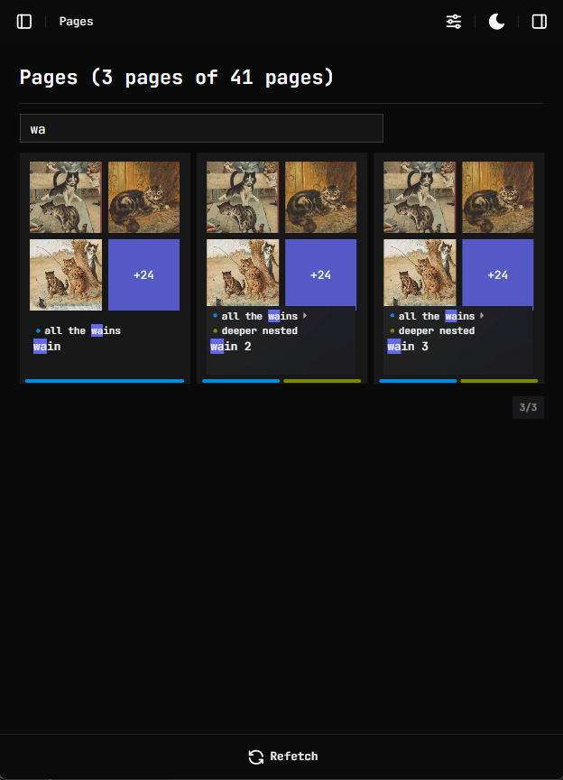

---

## Watch history

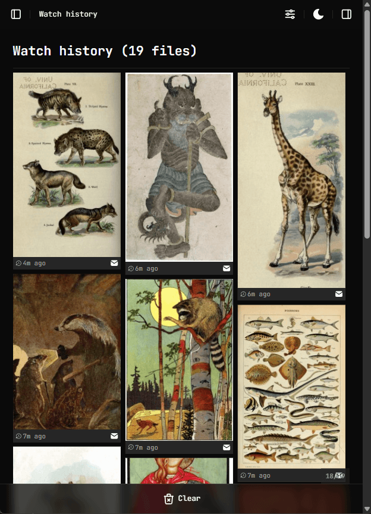

---

## Customization

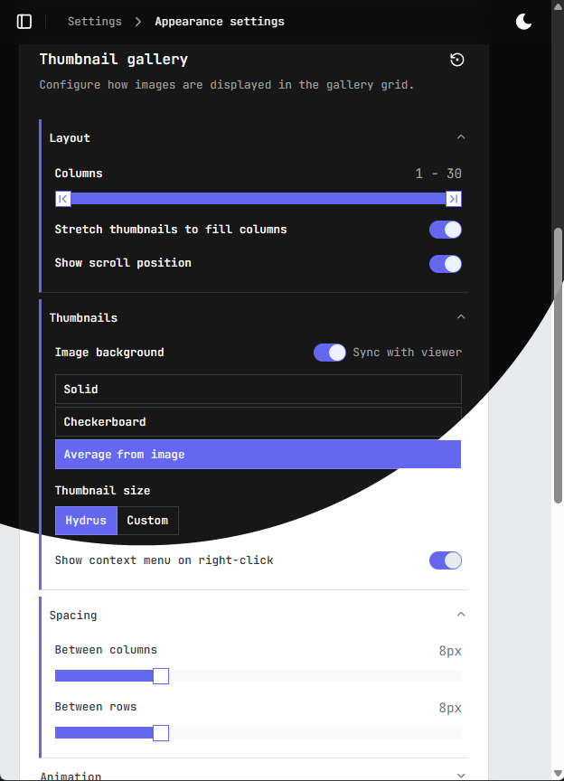
